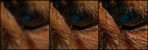
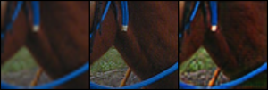
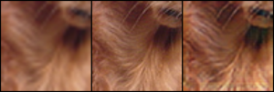

Photo-Realistic Single Image Super-Resolution using Generative Adversarial Network (SRGAN)
==========================================================================================

Photo-Realistic single image super-resolution using Generative Adversarial
Network (SRGAN) implemented using PyTorch. Source paper: [Photo-Realistic Single
Image Super-Resolution Using a Generative Adversarial
Network](https://arxiv.org/pdf/1609.04802.pdf)

SRGAN Architecture
------------------

Dataset
-------

[DIVerse 2K - DIV2K](https://data.vision.ee.ethz.ch/cvl/DIV2K/) resolution high
quality images dataset and
[VOC2012](https://www.kaggle.com/huanghanchina/pascal-voc-2012) dataset were
both randomly sampled and was used as training and validation set for this
project. Download the Train Data (HR images) and Validation Data (HR Images) zip
files and extract them under **data** folder.

Results obtained
----------------

Left image is Low Resolution Image, Middle image is original High Resolution
Image, and the right image is the Generated Super-Resolution Image.

### Sample 1

### Sample 2

Usage
-----

Use bash terminal or Powershell or Command Prompt

### For training

Change the training configuration (Epochs, Batch Size, Crop Size, Upscale
Factor) in the script.

`python train.py`

### For testing

Change the testing configuration (Upscale Factor & Trained Model path) in the
script.

`python test.py`

Check this [colab
notebook](https://colab.research.google.com/drive/1yWu4GAfAH6P8nQNVXCSA8mUPaBXOz2SP?usp=sharing)
for simple prediction pipeline.

Pretrained model
----------------

Pretrained model is available under the [trained_models](trained_models/)
folder.

### New Models

-   [Generator_2_64_100.pth](trained_models/Generator_2_64_100.pth) - Generator
    model trained with new dataset for upscale factor 2 & crop size 64 (trained
    for 100 epochs)

-   [Discriminator_2_64_100.pth](trained_models/Discriminator_2_64_100.pth) -
    Discriminator model trained with new dataset for upscale factor 2 & crop
    size 64 (trained for 100 epochs)

### Old Models

-   [generator_2_100.pth](trained_models/generator_2_100.pth) - Generator model
    for upscale factor 2 & crop size 88 (trained for 100 epochs)

-   [discriminator_2_100.pth](trained_models/discriminator_2_100.pth) -
    Discriminator model for upscale factor 2 & crop size 88 (trained for 100
    epochs)

-   [generator_4_100.pth](trained_models/generator_4_100.pth) - Generator model
    for upscale factor 4 & crop size 96 (trained for 100 epochs)

-   [discriminator_4_100.pth](trained_models/discriminator_4_100.pth) -
    Discriminator model for upscale factor 4 & crop size 96 (trained for 100
    epochs)

Module Description
------------------

-   [models.py](models.py) - Contains the implementation of Residual Block,
    UpSample Block, Generator, and Discriminator.

-   [losses.py](losses.py) - Contains the implementation of generator loss
    function (Image loss, Perpetual loss, Total Variation loss, and Adversarial
    loss. Have used WGAN).

-   [utils.py](utils.py) - Contains Transformation fucntions and custom Dataset
    classes for training and validation sets.

-   [pyssim.py](pyssim.py) - Contains functions to calculate Structural
    similarity scores and Peak Signal to Noise ratio of given images.

-   [train.py](train.py) - Training script to train the SRGAN model.

-   [test.py](test.py) - A simple test script to convert low resolution image to
    super resolution using the trained model.

Requirements
------------

Python 3 is required. I trained the model for 100 epochs on NVIDIA GTX 3050 4GB
GPU and 16 GB RAM which took almost 2 hours to get completed.

### My System Configuration

-   Windows 11 Home 64-bit OS

-   NVIDIA GTX 3050 4GB GPU

-   16 GB DDR4 RAM

-   Python 3.8 64-bit

-   CUDA 12.4

-   CUDNN 9.1

### Required libraries

All the required libraries have been included in the
[requirements.txt](requirements.txt) file.

-   PyTorch (torch)

-   Torchvision (torchvision)

-   Numpy (numpy)

-   Matplotlib (matplotlib)

-   Pillow (Pillow)

-   Pandas (pandas)

-   OpenCV (opencv-python)

### Install the Requirements

Install the required libraries using [pip](https://pip.pypa.io/en/stable/)
package manager

`pip install -r requirements.txt`

Future Scopes
-------------

-   Try variants of SRGAN and do a comparison.

-   Build a Web UI in which user can upload low resolution images and convert
    them to high resolution images

-    

Reference Papers
----------------

-   [SRGAN - Photo-Realistic Single Image Super-Resolution Using a Generative
    Adversarial Network](https://arxiv.org/pdf/1609.04802.pdf)

-   [WGAN - Wassertein GAN](https://arxiv.org/pdf/1701.07875.pdf)

-   [NTIRE 2017 Challenge on Single Image Super-Resolution: Dataset and
    Study](https://people.ee.ethz.ch/~timofter/publications/Agustsson-CVPRW-2017.pdf)
